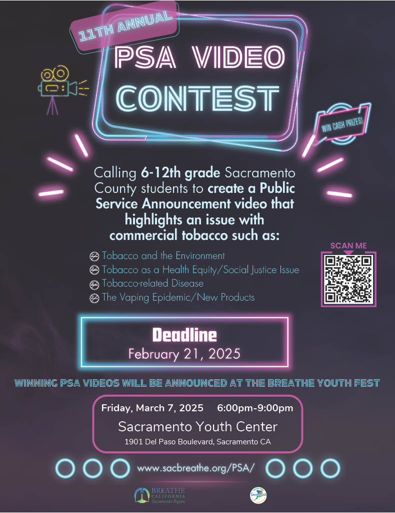
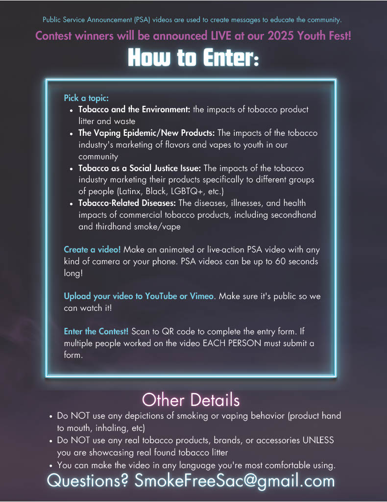

The Breathe California Sacramento Region’s 11thAnnual Public Service Announcement (PSA) Video Contest is open now through **February 21, 2025**!  All 6th -12th grade students who live or attend school within Sacramento County are encouraged to participate. Students are asked to put their creative skills to the test by developing a PSA video, up to 60 seconds in length, to raise awareness about the dangers of commercial tobacco use in their communities. Videos can be recorded using phones, cameras, laptops, or any other device. **Winners will be announced at the Breathe Youth Fest on March 7, 2025, at the Sacramento Youth Center and will receive cash prizes!**

