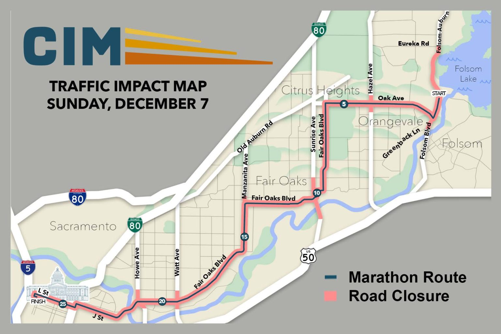

The 42nd California International Marathon will be held Sunday, December 7th, 2025. The race begins in Folsom near the Folsom Dam and travels the same route as it has for forty-plus years along Oak Avenue, Fair Oaks Blvd, J Street and L Street, finishing at the Capitol. As in previous years, some intersections in or near our neighborhood will be impacted on that morning. J Street from Carlson to Alhambra; Alhambra from J Street to Capitol Ave and L Street from Alhambra to 15th Street will be closed from 8:00 am to 2:30 pm (approximately). The Capitol Mall and L Street around the Capitol will be closed from 3:00 am to 4:00 pm (approximately).

