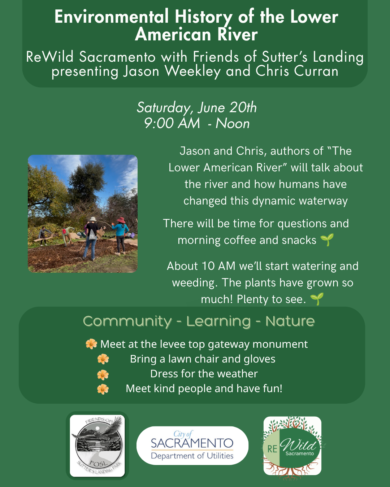

Join us for a fun filled, educational morning at Sutter’s Landing on Saturday, June 20th. You’ll learn about the history of the river and have an opportunity to help improve the landscape of this special area.

