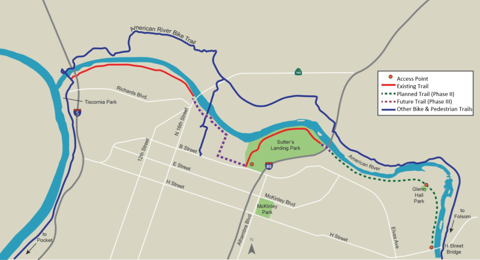

The City of Sacramento is seeking [feedback](https://4thomq26tgq.typeform.com/to/ByBVxBsf) on the potential routes to complete the [Two Rivers Trail system](https://www.cityofsacramento.gov/public-works/engineering/projects/two-rivers-trail-project).

This phase of the project will extend the trail within Sutter’s Landing Park at 28th Street west, approximately one mile, to a loop around the Old City Landfill, just east of the Union Pacific Railroad (UPRR) tracks. West of the UPRR tracks, the trail will connect to the Sacramento Northern Trail and continue west to join the existing Two Rivers Trail.

“This will close the majority of the gaps in the trail and we’re looking for public feedback on their preferences on what the exact route should look like,” said Adam Randolph, project manager and senior engineer with the City’s [Department of Public Works.](https://www.cityofsacramento.gov/public-works)

The survey on the alternative routes is [available online here](https://4thomq26tgq.typeform.com/to/ByBVxBsf) through Sept. 10.

The project will also explore alternatives to cross UPRR and State Route 160 to connect with the Two Rivers Trail. Environmental clearance, design and construction of the UPRR and State Route 160 crossings will likely be addressed in a future project.
