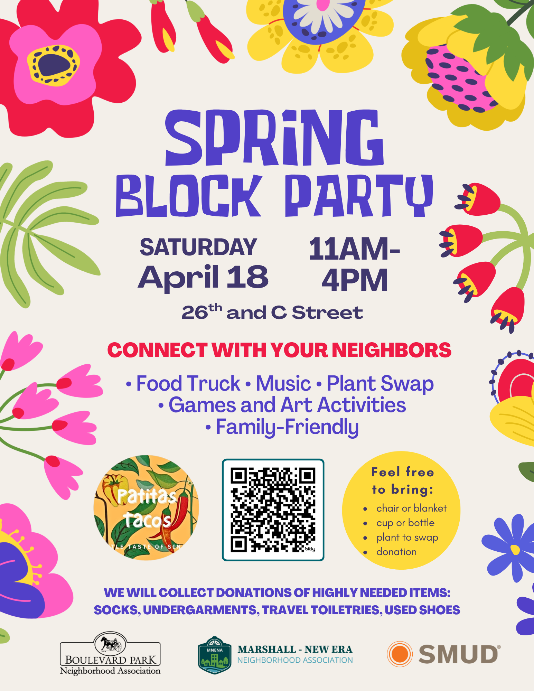

Join your neighborhood associations for our **2nd Annual Spring Block Party!** Family-friendly activities for all ages. Music, food, and games. Meet your neighbors, make new friends, and learn about what’s going on in our community, including at the New Era Community Garden!  
  
There will also be a “Plant/Seedling Swap” for those who want to bring a plant and swap it for another. Bring your starts or plants you have too many of and swap them for something else.

**Admission is FREE!**

**Hosted By**[**:**](https://marshallnewera.us17.list-manage.com/track/click?u=f15fc7d66ef8c326221bf4228&id=365f232048&e=51e76e1e0e) [**Marshall-New Era & Boulevard Park Neighborhood Associations**](https://marshallnewera.us17.list-manage.com/track/click?u=f15fc7d66ef8c326221bf4228&id=127f8bb568&e=51e76e1e0e)  
  
**Who**: All residents are welcome! You do not need to be a member of the neighborhood associations to attend.  
  
**Date**: Saturday, April 18th  
  
**Time**: 11am – 4pm (food truck too!)  
  
**Location**: 26th St and C St cul-de-sac  
  
**Volunteer**: We need volunteers! [Click here](https://marshallnewera.us17.list-manage.com/track/click?u=f15fc7d66ef8c326221bf4228&id=d7522a7b2b&e=51e76e1e0e) if you can help out with the event, the link has several areas where we need assistance.

**Resources Needed:** We’re looking for a few items to help make the event successful: pop-up canopies, lemons, and non-toxic acrylic paint. If you can help, please email Quinn at [qbuniel@gmail.com](mailto:qbuniel@gmail.com).

  
**Transportation**: We encourage neighbors to walk or bike to the party. Limited street parking is available near Leland Stanford Park, one block from the event.

  
**Flyer**: Download the event flyer [here](https://marshallnewera.us17.list-manage.com/track/click?u=f15fc7d66ef8c326221bf4228&id=05670ca9cb&e=51e76e1e0e).

